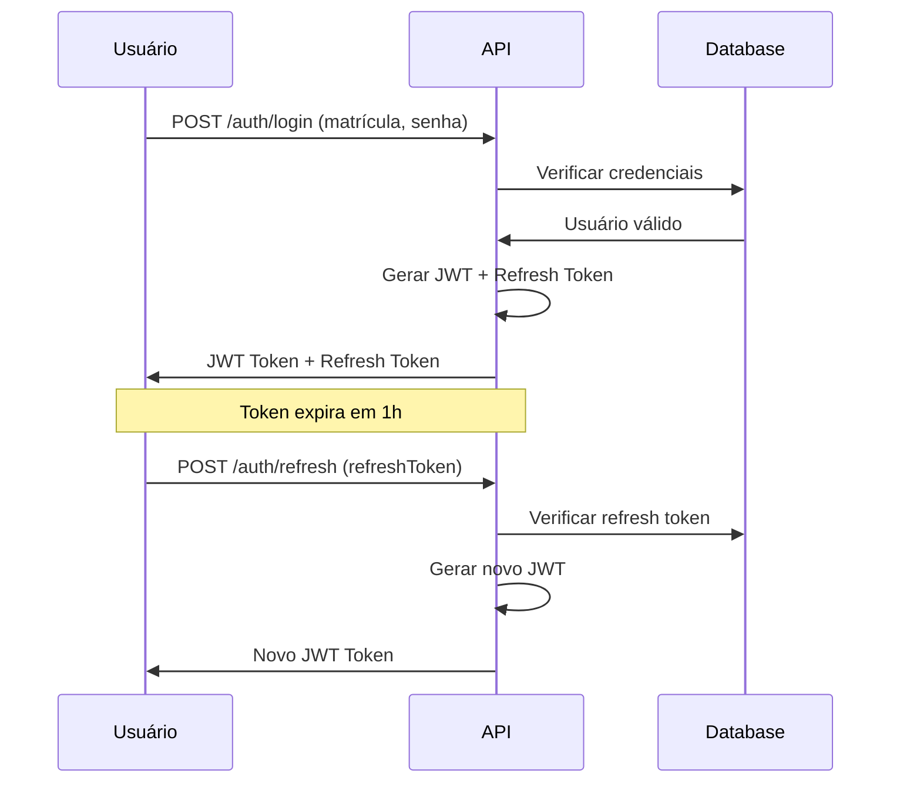
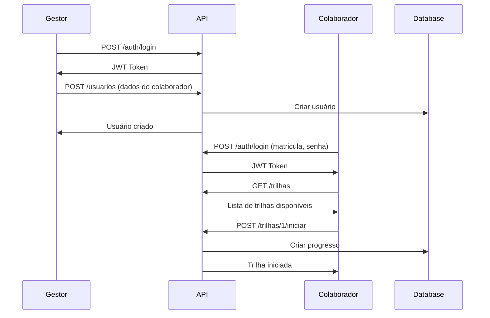

# API de Treinamento Corporativo - Documentação Técnica

## Índice

1. [Introdução](#introdução)
2. [Autenticação](#autenticação)
3. [Schemas de Dados](#schemas-de-dados)
4. [Endpoints](#endpoints)
   - [4.1 Autenticação](#41-autenticação)
   - [4.2 Usuários](#42-usuários)
   - [4.3 Módulos](#43-módulos)
   - [4.4 Conteúdos](#44-conteúdos)
   - [4.5 Trilhas](#45-trilhas)
   - [4.6 Avaliações](#46-avaliações)
   - [4.7 Certificados](#47-certificados)
   - [4.8 Recompensas](#48-recompensas)
   - [4.9 Desafios](#49-desafios)
5. [Códigos de Status HTTP](#códigos-de-status-http)
6. [Guias de Implementação](#guias-de-implementação)
7. [Exemplos de Integração](#exemplos-de-integração)

---

## Introdução

Esta API fornece um sistema completo de treinamento corporativo com funcionalidades de gamificação, certificação e gestão de aprendizagem. A plataforma permite que gestores criem trilhas de treinamento, acompanhem o progresso dos colaboradores e implementem sistemas de recompensas.

### Tecnologias Utilizadas

- **Runtime**: Node.js
- **Framework**: Hono.js
- **ORM**: Prisma
- **Banco de Dados**: SQLite
- **Autenticação**: JWT + Refresh Tokens
- **Criptografia**: bcrypt

### Informações Gerais

- **URL Base**: `http://localhost:3000`
- **Formato de Dados**: JSON
- **Charset**: UTF-8
- **Versão da API**: 1.0

---

## Autenticação

A API utiliza autenticação baseada em JWT (JSON Web Tokens) com suporte a refresh tokens para sessões prolongadas.

### Tipos de Usuários

| Tipo | Autoridade | Permissões |
|------|------------|------------|
| **Admin** | `admin` | Acesso total ao sistema, pode criar gestores |
| **Gestor** | `gestor` | Pode criar e gerenciar conteúdos, trilhas e usuários colaboradores |
| **Colaborador** | `colaborador` | Pode consumir conteúdos, fazer avaliações e resgatar recompensas |

### Headers de Autenticação

Para endpoints protegidos, inclua o token JWT no header:

```http
Authorization: Bearer <seu_jwt_token>
```

### Fluxo de Autenticação



---

## Schemas de Dados

### Usuario

```typescript
interface Usuario {
  id: number;
  gestor_id?: number;
  nome: string;
  matricula: string; // Único
  senha: string; // Hash bcrypt
  setor: string;
  funcao: string; // Ex: "Desenvolvedor", "Analista", "Gerente"
  pontos: number; // Default: 0
  autoridade: 'admin' | 'gestor' | 'colaborador';
}
```

### Modulo

```typescript
interface Modulo {
  id: number;
  nome: string;
  descricao: string;
  gestor_id: number;
  conteudos: Conteudo[];
}
```

### Conteudo

```typescript
interface Conteudo {
  id: number;
  modulo_id: number;
  tipo: string;
  titulo: string;
  descricao: string;
  url_video: string;
  url_pdf?: string;
  ordem: number;
  gestor_id: number;
}
```

### TrilhaAprendizagem

```typescript
interface TrilhaAprendizagem {
  id: number;
  nome: string;
  descricao: string;
  gestor_id: number;
  modulos: {
    modulo_id: number;
    ordem: number;
  }[];
}
```

### Avaliacao

```typescript
interface Avaliacao {
  id: number;
  conteudo_id?: number; // Opcional
  trilha_id?: number; // Opcional
  titulo: string;
  descricao: string;
  gestor_id: number;
  questoes: Questao[];
}

interface Questao {
  id: number;
  avaliacao_id: number;
  texto: string;
  alternativas: Alternativa[];
}

interface Alternativa {
  id: number;
  questao_id: number;
  texto: string;
  correta: boolean;
}
```

### Certificado

```typescript
interface Certificado {
  id: number;
  usuario_id: number;
  trilha_id: number;
  data_emissao: string; // ISO Date
}
```

### Recompensa

```typescript
interface Recompensa {
  id: number;
  nome: string;
  descricao: string;
  moedas_requeridas: number;
  tipo: string;
  quantidade_disponivel?: number;
  gestor_id: number;
}
```

---

## Endpoints

### 4.1 Autenticação

#### POST `/auth/login`

Autentica um usuário e retorna tokens de acesso.

**Request Body:**
```json
{
  "matricula": "string",
  "senha": "string",
  "manterSessao": boolean // Opcional, gera refresh token
}
```

**Response (200):**
```json
{
  "token": "eyJhbGciOiJIUzI1NiIsInR5cCI6IkpXVCJ9...",
  "refreshToken": "550e8400-e29b-41d4-a716-446655440000", // Se manterSessao: true
  "usuario": {
    "id": 1,
    "nome": "Admin User",
    "matricula": "1",
    "autoridade": "admin",
    "funcao": "Administrador",
    "setor": "TI"
  }
}
```

**Exemplo:**
```http
POST http://localhost:3000/auth/login
Content-Type: application/json

{
  "matricula": "1",
  "senha": "admin",
  "manterSessao": true
}
```

#### GET `/auth/verificar`

Verifica se o token JWT é válido.

**Headers:**
```http
Authorization: Bearer <jwt_token>
```

**Response (200):**
```json
{
  "valido": true,
  "usuario": {
    "id": 1,
    "nome": "Admin User",
    "autoridade": "admin"
  }
}
```

#### POST `/auth/refresh`

Renova o token JWT usando refresh token.

**Request Body:**
```json
{
  "refreshToken": "550e8400-e29b-41d4-a716-446655440000"
}
```

**Response (200):**
```json
{
  "token": "eyJhbGciOiJIUzI1NiIsInR5cCI6IkpXVCJ9..."
}
```

#### POST `/auth/logout`

Revoga o refresh token.

**Request Body:**
```json
{
  "refreshToken": "550e8400-e29b-41d4-a716-446655440000"
}
```

**Response (200):**
```json
{
  "message": "Logout realizado com sucesso"
}
```

---

### 4.2 Usuários

#### GET `/usuarios`

**Permissão:** Admin, Gestor

Lista todos os usuários do sistema.

**Headers:**
```http
Authorization: Bearer <jwt_token>
```

**Response (200):**
```json
[
  {
    "id": 1,
    "nome": "Admin User",
    "matricula": "1",
    "setor": "TI",
    "funcao": "Administrador",
    "autoridade": "admin",
    "pontos": 0
  },
  {
    "id": 2,
    "nome": "Colaborador Teste",
    "matricula": "colab123",
    "setor": "RH",
    "funcao": "Analista de RH",
    "autoridade": "colaborador",
    "pontos": 150
  }
]
```

#### GET `/usuarios/{id}`

**Permissão:** Admin, Gestor

Busca um usuário específico por ID.

**Response (200):**
```json
{
  "id": 2,
  "nome": "Colaborador Teste",
  "matricula": "colab123",
  "setor": "RH",
  "funcao": "Analista de RH",
  "autoridade": "colaborador",
  "pontos": 150,
  "gestor_id": 1
}
```

#### POST `/usuarios`

**Permissão:** Admin

Cria um novo usuário.

**Request Body:**
```json
{
  "nome": "string",
  "matricula": "string", // Deve ser único
  "senha": "string",
  "setor": "string",
  "funcao": "string", // Ex: "Desenvolvedor", "Analista", "Gerente"
  "autoridade": "colaborador" | "gestor" | "admin"
}
```

**Response (201):**
```json
{
  "id": 3,
  "nome": "Novo Colaborador",
  "matricula": "new123",
  "setor": "Vendas",
  "funcao": "Vendedor",
  "autoridade": "colaborador",
  "pontos": 0,
  "gestor_id": 1
}
```

#### PUT `/usuarios/{id}`

**Permissão:** Admin, Gestor (próprios colaboradores)

Atualiza dados de um usuário.

**Request Body:**
```json
{
  "nome": "string",
  "setor": "string",
  "funcao": "string" // Opcional, ex: "Analista", "Gerente"
  // Outros campos opcionais
}
```

#### DELETE `/usuarios/{id}`

**Permissão:** Admin

Remove um usuário do sistema.

**Response (200):**
```json
{
  "message": "Usuário removido com sucesso"
}
```

---

### 4.3 Módulos

#### GET `/modulos`

**Permissão:** Admin, Gestor, Colaborador

Lista todos os módulos disponíveis.

**Response (200):**
```json
[
  {
    "id": 1,
    "nome": "Módulo de Introdução",
    "descricao": "Introdução aos conceitos básicos de construção civil",
    "gestor_id": 1,
    "conteudos": []
  }
]
```

#### GET `/modulos/{id}`

**Permissão:** Admin, Gestor, Colaborador

Busca um módulo específico com seus conteúdos.

**Response (200):**
```json
{
  "id": 1,
  "nome": "Módulo de Introdução",
  "descricao": "Introdução aos conceitos básicos de construção civil",
  "gestor_id": 1,
  "conteudos": [
    {
      "id": 1,
      "titulo": "Introdução ao curso",
      "descricao": "Vídeo introdutório sobre a plataforma",
      "tipo": "video",
      "ordem": 1
    }
  ]
}
```

#### POST `/modulos`

**Permissão:** Admin, Gestor

Cria um novo módulo.

**Request Body:**
```json
{
  "nome": "string",
  "descricao": "string"
}
```

**Response (201):**
```json
{
  "id": 2,
  "nome": "Módulo de Introdução",
  "descricao": "Introdução aos conceitos básicos de construção civil",
  "gestor_id": 1
}
```

#### PUT `/modulos/{id}`

**Permissão:** Admin, Gestor (próprios módulos)

Atualiza um módulo existente.

#### DELETE `/modulos/{id}`

**Permissão:** Admin, Gestor (próprios módulos)

Remove um módulo.

---

### 4.4 Conteúdos

#### GET `/conteudos`

**Permissão:** Admin, Gestor, Colaborador

Lista todos os conteúdos.

#### GET `/conteudos/{id}`

**Permissão:** Admin, Gestor, Colaborador

Busca um conteúdo específico.

#### GET `/conteudos/modulo/{moduloId}`

**Permissão:** Admin, Gestor, Colaborador

Lista conteúdos de um módulo específico.

**Response (200):**
```json
[
  {
    "id": 1,
    "modulo_id": 1,
    "tipo": "video",
    "titulo": "Introdução ao curso",
    "descricao": "Vídeo introdutório sobre a plataforma de treinamentos",
    "url_video": "https://exemplo.com/videos/intro.mp4",
    "url_pdf": "https://exemplo.com/docs/intro.pdf",
    "ordem": 1,
    "gestor_id": 1
  }
]
```

#### POST `/conteudos`

**Permissão:** Admin, Gestor

Cria um novo conteúdo.

**Request Body:**
```json
{
  "modulo_id": number,
  "tipo": "string",
  "titulo": "string",
  "descricao": "string",
  "url_video": "string",
  "url_pdf": "string", // Opcional
  "ordem": number
}
```

#### POST `/conteudos/{id}/assistir`

**Permissão:** Colaborador autenticado

Marca um conteúdo como assistido pelo usuário atual.

**Response (200):**
```json
{
  "message": "Conteúdo marcado como assistido",
  "progresso": {
    "conteudo_id": 1,
    "data_assistido": "2025-06-09T19:04:00.000Z"
  }
}
```

---

### 4.5 Trilhas

#### GET `/trilhas`

**Permissão:** Admin, Gestor, Colaborador

Lista todas as trilhas de aprendizagem.

**Response (200):**
```json
[
  {
    "id": 1,
    "nome": "Trilha de Construção Civil Básica",
    "descricao": "Trilha introdutória para novos colaboradores da área de construção",
    "gestor_id": 1,
    "modulos": [
      {
        "modulo_id": 1,
        "ordem": 1,
        "modulo": {
          "nome": "Módulo de Introdução",
          "descricao": "Conceitos básicos"
        }
      }
    ]
  }
]
```

#### GET `/trilhas/{id}`

**Permissão:** Admin, Gestor, Colaborador

Busca uma trilha específica.

#### POST `/trilhas`

**Permissão:** Admin, Gestor

Cria uma nova trilha de aprendizagem.

**Request Body:**
```json
{
  "nome": "string",
  "descricao": "string",
  "modulos": [
    {
      "modulo_id": number,
      "ordem": number
    }
  ]
}
```

#### POST `/trilhas/{id}/iniciar`

**Permissão:** Colaborador autenticado

Inicia uma trilha para o usuário atual.

**Response (200):**
```json
{
  "message": "Trilha iniciada com sucesso",
  "progresso": {
    "id": 1,
    "usuario_id": 2,
    "trilha_id": 1,
    "percentual": 0.0,
    "finalizado": false,
    "data_inicio": "2025-06-09T19:04:00.000Z"
  }
}
```

#### GET `/trilhas/{id}/progresso`

**Permissão:** Colaborador autenticado

Verifica o progresso do usuário atual na trilha.

**Response (200):**
```json
{
  "trilha_id": 1,
  "percentual": 45.5,
  "finalizado": false,
  "data_inicio": "2025-06-09T19:04:00.000Z",
  "modulos_concluidos": 2,
  "total_modulos": 4,
  "proximo_conteudo": {
    "id": 5,
    "titulo": "Segurança no Trabalho"
  }
}
```

---

### 4.6 Avaliações

#### GET `/avaliacoes`

**Permissão:** Admin, Gestor, Colaborador

Lista todas as avaliações.

#### GET `/avaliacoes/{id}`

**Permissão:** Admin, Gestor, Colaborador

Busca uma avaliação específica.

#### POST `/avaliacoes`

**Permissão:** Admin, Gestor

Cria uma nova avaliação.

**Para avaliação de conteúdo:**
```json
{
  "titulo": "string",
  "descricao": "string",
  "conteudo_id": number
}
```

**Para avaliação de trilha:**
```json
{
  "titulo": "string",
  "descricao": "string",
  "trilha_id": number
}
```

#### GET `/avaliacoes/{id}/questoes`

**Permissão:** Admin, Gestor, Colaborador

Lista questões de uma avaliação.

**Response (200):**
```json
[
  {
    "id": 1,
    "avaliacao_id": 1,
    "texto": "Qual é o principal componente do concreto?",
    "alternativas": [
      {
        "id": 1,
        "texto": "Cimento",
        "correta": true
      },
      {
        "id": 2,
        "texto": "Areia",
        "correta": false
      }
    ]
  }
]
```

#### POST `/avaliacoes/{id}/questoes`

**Permissão:** Admin, Gestor

Adiciona uma nova questão à avaliação.

**Request Body:**
```json
{
  "texto": "string",
  "alternativas": [
    {
      "texto": "string",
      "correta": boolean
    }
  ]
}
```

#### POST `/avaliacoes/{id}/responder`

**Permissão:** Colaborador autenticado

Submete respostas para uma avaliação.

**Request Body:**
```json
{
  "respostas": [
    {
      "questao_id": number,
      "alternativa_id": number
    }
  ]
}
```

**Response (200):**
```json
{
  "avaliacao_id": 1,
  "pontuacao": 85,
  "acertos": 17,
  "total_questoes": 20,
  "aprovado": true,
  "pontos_ganhos": 50,
  "moedas_ganhas": 25
}
```

---

### 4.7 Certificados

#### GET `/certificados`

**Permissão:** Admin, Gestor

Lista todos os certificados emitidos.

#### GET `/certificados/usuario/{usuarioId}`

**Permissão:** Admin, Gestor, Próprio usuário

Lista certificados de um usuário específico.

#### GET `/certificados/{id}`

**Permissão:** Admin, Gestor, Proprietário do certificado

Busca um certificado específico.

#### POST `/certificados/emitir/{trilhaId}`

**Permissão:** Colaborador autenticado

Emite certificado para uma trilha completada.

**Response (201):**
```json
{
  "id": 1,
  "usuario_id": 2,
  "trilha_id": 1,
  "data_emissao": "2025-06-09T19:04:00.000Z",
  "trilha": {
    "nome": "Trilha de Construção Civil Básica"
  }
}
```

#### GET `/certificados/{id}/download`

**Permissão:** Admin, Gestor, Proprietário do certificado

Faz download do certificado em PDF.

**Response:** Arquivo PDF

---

### 4.8 Recompensas

#### GET `/recompensas`

**Permissão:** Admin, Gestor, Colaborador

Lista todas as recompensas disponíveis.

**Response (200):**
```json
[
  {
    "id": 1,
    "nome": "Dia de folga",
    "descricao": "Um dia de folga para o colaborador",
    "moedas_requeridas": 1000,
    "tipo": "BENEFICIO",
    "quantidade_disponivel": 5,
    "gestor_id": 1
  }
]
```

#### POST `/recompensas`

**Permissão:** Admin, Gestor

Cria uma nova recompensa.

**Request Body:**
```json
{
  "nome": "string",
  "descricao": "string",
  "moedas_requeridas": number,
  "tipo": "string",
  "quantidade_disponivel": number // Opcional
}
```

#### POST `/recompensas/{id}/resgatar`

**Permissão:** Colaborador autenticado

Resgata uma recompensa usando moedas.

**Response (200):**
```json
{
  "message": "Recompensa resgatada com sucesso",
  "resgate": {
    "id": 1,
    "usuario_id": 2,
    "recompensa_id": 1,
    "data_resgate": "2025-06-09T19:04:00.000Z",
    "status": "PENDENTE"
  },
  "saldo_restante": 250
}
```

#### GET `/recompensas/usuario/minhas`

**Permissão:** Colaborador autenticado

Lista recompensas do usuário atual.

#### GET `/recompensas/saldo/moedas`

**Permissão:** Colaborador autenticado

Verifica saldo de moedas do usuário atual.

**Response (200):**
```json
{
  "usuario_id": 2,
  "saldo_moedas": 1250,
  "historico_recente": [
    {
      "tipo_evento": "avaliacao_aprovada",
      "moedas": 25,
      "data_evento": "2025-06-09T19:04:00.000Z",
      "descricao": "Avaliação: Segurança no Trabalho"
    }
  ]
}
```

---

### 4.9 Desafios

#### GET `/desafios`

**Permissão:** Admin, Gestor, Colaborador

Lista todos os desafios disponíveis.

#### POST `/desafios`

**Permissão:** Admin, Gestor

Cria um novo desafio.

**Request Body:**
```json
{
  "nome": "string",
  "descricao": "string"
}
```

#### GET `/desafios/{id}/etapas`

**Permissão:** Admin, Gestor, Colaborador

Lista etapas de um desafio.

#### POST `/desafios/{id}/etapas`

**Permissão:** Admin, Gestor

Adiciona uma etapa ao desafio.

**Request Body:**
```json
{
  "avaliacao_id": number,
  "ordem": number
}
```

---

## Códigos de Status HTTP

### Códigos de Sucesso

| Código | Descrição |
|--------|-----------|
| 200 | OK - Requisição processada com sucesso |
| 201 | Created - Recurso criado com sucesso |
| 204 | No Content - Requisição processada, sem conteúdo na resposta |

### Códigos de Erro

| Código | Descrição | Exemplo |
|--------|-----------|---------|
| 400 | Bad Request - Dados inválidos na requisição | Campos obrigatórios faltando |
| 401 | Unauthorized - Token JWT inválido ou expirado | Token não fornecido |
| 403 | Forbidden - Usuário sem permissão para a ação | Colaborador tentando criar módulo |
| 404 | Not Found - Recurso não encontrado | Usuário com ID inexistente |
| 409 | Conflict - Conflito de dados | Matrícula já existe |
| 422 | Unprocessable Entity - Dados válidos mas não processáveis | Senha muito fraca |
| 500 | Internal Server Error - Erro interno do servidor | Erro de banco de dados |

### Formato de Resposta de Erro

```json
{
  "error": {
    "code": "VALIDATION_ERROR",
    "message": "Dados de entrada inválidos",
    "details": {
      "field": "matricula",
      "issue": "Matrícula já existe no sistema"
    }
  },
  "timestamp": "2025-06-09T19:04:00.000Z",
  "path": "/usuarios"
}
```

---

## Guias de Implementação

### Fluxo de Onboarding de Colaborador



### Sistema de Gamificação

#### Eventos que Geram Pontos/Moedas

| Evento | Pontos | Moedas | Observação |
|--------|--------|--------|------------|
| Conteúdo assistido | 10 | 5 | Por conteúdo |
| Avaliação aprovada (>70%) | 50 | 25 | Por avaliação |
| Trilha completada | 200 | 100 | Por trilha |
| Certificado emitido | 500 | 250 | Por certificado |
| Login diário | 5 | 2 | Streak bonus |

#### Exemplo de Implementação de Progresso

```javascript
// Exemplo de cálculo de progresso em trilha
function calcularProgressoTrilha(usuarioId, trilhaId) {
  // 1. Buscar todos os módulos da trilha
  // 2. Para cada módulo, verificar conteúdos assistidos
  // 3. Calcular percentual baseado em conteúdos/avaliações
  
  const totalItens = modulos.reduce((acc, modulo) => {
    return acc + modulo.conteudos.length + modulo.avaliacoes.length;
  }, 0);
  
  const itensCompletos = contarItensCompletos(usuarioId, modulos);
  
  return (itensCompletos / totalItens) * 100;
}
```

### Integração com Sistemas Externos

#### Exemplo de Integração via Webhook

```javascript
// Configurar webhook para notificar sistema RH sobre certificações
app.post('/webhooks/certificado-emitido', async (req, res) => {
  const { usuario_id, trilha_id, certificado_id } = req.body;
  
  // Enviar para sistema RH
  await fetch('https://rh.empresa.com/api/certificacoes', {
    method: 'POST',
    headers: {
      'Content-Type': 'application/json',
      'Authorization': 'Bearer ' + process.env.RH_API_TOKEN
    },
    body: JSON.stringify({
      funcionario_id: usuario_id,
      curso: trilha_id,
      certificado_url: `${BASE_URL}/certificados/${certificado_id}/download`
    })
  });
});
```

---

## Exemplos de Integração

### JavaScript/Node.js

```javascript
class TreinamentoAPI {
  constructor(baseUrl = 'http://localhost:3000') {
    this.baseUrl = baseUrl;
    this.token = null;
  }
  
  async login(matricula, senha, manterSessao = false) {
    const response = await fetch(`${this.baseUrl}/auth/login`, {
      method: 'POST',
      headers: { 'Content-Type': 'application/json' },
      body: JSON.stringify({ matricula, senha, manterSessao })
    });
    
    const data = await response.json();
    this.token = data.token;
    return data;
  }
  
  async listarTrilhas() {
    const response = await fetch(`${this.baseUrl}/trilhas`, {
      headers: { 'Authorization': `Bearer ${this.token}` }
    });
    
    return response.json();
  }
  
  async iniciarTrilha(trilhaId) {
    const response = await fetch(`${this.baseUrl}/trilhas/${trilhaId}/iniciar`, {
      method: 'POST',
      headers: { 'Authorization': `Bearer ${this.token}` }
    });
    
    return response.json();
  }
  
  async verificarProgresso(trilhaId) {
    const response = await fetch(`${this.baseUrl}/trilhas/${trilhaId}/progresso`, {
      headers: { 'Authorization': `Bearer ${this.token}` }
    });
    
    return response.json();
  }
}

// Uso
const api = new TreinamentoAPI();
await api.login('1', 'admin');
const trilhas = await api.listarTrilhas();
console.log(trilhas);
```

### Python

```python
import requests
import json

class TreinamentoAPI:
    def __init__(self, base_url='http://localhost:3000'):
        self.base_url = base_url
        self.token = None
    
    def login(self, matricula, senha, manter_sessao=False):
        url = f"{self.base_url}/auth/login"
        data = {
            'matricula': matricula,
            'senha': senha,
            'manterSessao': manter_sessao
        }
        
        response = requests.post(url, json=data)
        result = response.json()
        
        if response.status_code == 200:
            self.token = result['token']
        
        return result
    
    def listar_trilhas(self):
        url = f"{self.base_url}/trilhas"
        headers = {'Authorization': f'Bearer {self.token}'}
        
        response = requests.get(url, headers=headers)
        return response.json()
    
    def submeter_avaliacao(self, avaliacao_id, respostas):
        url = f"{self.base_url}/avaliacoes/{avaliacao_id}/responder"
        headers = {
            'Authorization': f'Bearer {self.token}',
            'Content-Type': 'application/json'
        }
        data = {'respostas': respostas}
        
        response = requests.post(url, json=data, headers=headers)
        return response.json()

# Uso
api = TreinamentoAPI()
api.login('colab123', 'senha123')
trilhas = api.listar_trilhas()
print(trilhas)
```

### PHP

```php
<?php
class TreinamentoAPI {
    private $baseUrl;
    private $token;
    
    public function __construct($baseUrl = 'http://localhost:3000') {
        $this->baseUrl = $baseUrl;
    }
    
    public function login($matricula, $senha, $manterSessao = false) {
        $url = $this->baseUrl . '/auth/login';
        $data = json_encode([
            'matricula' => $matricula,
            'senha' => $senha,
            'manterSessao' => $manterSessao
        ]);
        
        $context = stream_context_create([
            'http' => [
                'method' => 'POST',
                'header' => 'Content-Type: application/json',
                'content' => $data
            ]
        ]);
        
        $response = file_get_contents($url, false, $context);
        $result = json_decode($response, true);
        
        if (isset($result['token'])) {
            $this->token = $result['token'];
        }
        
        return $result;
    }
    
    public function listarRecompensas() {
        $url = $this->baseUrl . '/recompensas';
        $context = stream_context_create([
            'http' => [
                'method' => 'GET',
                'header' => 'Authorization: Bearer ' . $this->token
            ]
        ]);
        
        $response = file_get_contents($url, false, $context);
        return json_decode($response, true);
    }
}

// Uso
$api = new TreinamentoAPI();
$api->login('1', 'admin');
$recompensas = $api->listarRecompensas();
print_r($recompensas);
?>
```

---

## Melhores Práticas

### Segurança

1. **Sempre validar tokens JWT** antes de processar requisições
2. **Implementar rate limiting** para endpoints de autenticação
3. **Usar HTTPS em produção** para proteger tokens
4. **Implementar refresh token rotation** para maior segurança
5. **Validar permissões** baseadas no nível de autoridade do usuário

### Performance

1. **Implementar cache** para dados frequentemente acessados (trilhas, módulos)
2. **Usar paginação** em endpoints que retornam listas grandes
3. **Implementar eager loading** para relacionamentos necessários
4. **Otimizar queries** do banco de dados com indexes adequados

### Monitoramento

1. **Implementar logs estruturados** para todas as operações
2. **Monitorar métricas** de uso (logins, conclusões de trilha, etc.)
3. **Alertas para falhas** de autenticação e erros 500
4. **Dashboard de progresso** para gestores acompanharem equipes

### Integração

1. **Documentar todos os webhooks** disponíveis
2. **Implementar versionamento** da API para mudanças futuras
3. **Fornecer SDKs** para linguagens principais
4. **Ambiente de sandbox** para testes

---

**Documentação atualizada em:** 09/06/2025  
**Versão da API:** 1.0  
**Suporte:** Para dúvidas ou problemas, consulte a equipe de desenvolvimento.