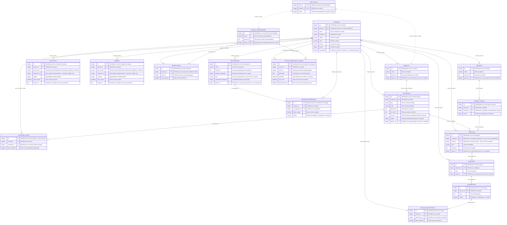

```mermaid
---
config:
  theme: default
---
erDiagram
    USUARIOS {
      integer id PK "Identificador único do usuário"
      integer gestor_id FK "ID do gestor que criou o usuário (opcional)"
      varchar nome "Nome completo do usuário"
      varchar matricula "Matrícula do usuário"
      varchar senha "Senha do usuário"
      varchar setor "Setor do usuário"
      varchar funcao "Função do usuário"
      integer pontos "Pontos do usuário"
      varchar autoridade "Função do usuário no sistema (ex.: colaborador, gestor)"
    }
    MODULOS {
      integer id PK "Identificador único do módulo"
      varchar nome "Nome do módulo"
      text descricao "Descrição detalhada do módulo"
      integer gestor_id FK "Referência ao usuário gestor que criou o módulo"
    }
    CONTEUDOS {
      integer id PK "Identificador único da aula/conteúdo"
      integer modulo_id FK "Referência ao módulo"
      varchar tipo "Tipo do conteúdo (video)"
      varchar titulo "Título da aula/conteúdo"
      text descricao "Descrição do conteúdo"
      text url_video "URL para acesso ao vídeo"
      text url_pdf "URL para leitura complementar (PDF, opcional)"
      integer ordem "Ordem de apresentação dentro do módulo"
      integer gestor_id FK "Referência ao usuário gestor que criou o conteúdo"
    }
    TRILHAS_APRENDIZAGEM {
      integer id PK "Identificador único da trilha de aprendizagem"
      varchar nome "Nome da trilha de aprendizagem"
      text descricao "Descrição da trilha de aprendizagem"
      integer gestor_id FK "Referência ao usuário gestor que criou a trilha"
    }
    ITEM_TRILHA {
      integer trilha_id PK, FK "Referência à trilha de aprendizagem"
      integer modulo_id PK, FK "Referência ao módulo"
      integer ordem "Ordem de apresentação do módulo na trilha"
    }
    CONTEUDO_CHECK {
      integer id PK "Identificador único do registro de vídeo assistido"
      integer usuario_id FK "Referência ao usuário"
      integer conteudo_id FK "Referência ao conteúdo (vídeo assistido)"
      datetime data_assistido "Data e hora do registro (timestamp)"
    }
    AVALIACAO {
      integer id PK "Identificador único da avaliação"
      integer conteudo_id FK "Referência ao conteúdo (aula/vídeo) - Nulo se for de etapa/desafio"
      integer etapa_id FK "Referência à etapa do desafio - Nulo se for de conteúdo"
      varchar titulo "Título da avaliação"
      text descricao "Descrição da avaliação"
      integer gestor_id FK "Referência ao usuário gestor que criou a avaliação"
    }
    QUESTOES {
      integer id PK "Identificador único da questão"
      integer avaliacao_id FK "Referência à avaliação"
      text texto "Texto da questão"
      integer gestor_id FK "Referência ao usuário gestor que criou a questão"
    }
    ALTERNATIVAS {
      integer id PK "Identificador único da alternativa"
      integer questao_id FK "Referência à questão"
      text texto "Texto da alternativa"
      boolean correta "Indicador se a alternativa é a correta"
    }
    AVALIACAO_RESPOSTAS {
      integer id PK "Identificador único da resposta"
      integer usuario_id FK "Referência ao usuário"
      integer alternativa_id FK "Referência à alternativa escolhida"
      datetime data_resposta "Data e hora da resposta"
    }
    PONTUACAO {
      integer id PK "Identificador único do registro de pontos"
      integer usuario_id FK "Referência ao usuário"
      varchar tipo_evento "Tipo de evento (CONTEUDO, AVALIACAO, MODULO, TRILHA)"
      integer referencia_id "ID do registro relacionado (ex.: conteúdo, módulo, etc.)"
      integer pontos "Quantidade de pontos ganhos"
      datetime data_evento "Data e hora do evento"
      text descricao "Descrição ou detalhes do evento (opcional)"
    }
    MOEDAS {
      integer id PK "Identificador único do registro de moedas"
      integer usuario_id FK "Referência ao usuário"
      varchar tipo_evento "Tipo de evento (CONTEUDO, AVALIACAO, MODULO, TRILHA)"
      integer referencia_id "ID do registro relacionado (ex.: conteúdo, módulo, etc.)"
      integer moedas "Quantidade de moedas ganhas"
      datetime data_evento "Data e hora do evento"
      text descricao "Descrição ou detalhes do evento (opcional)"
    }
    CERTIFICADOS {
      integer id PK "Identificador único do certificado"
      integer usuario_id FK "Referência ao usuário que completou a trilha"
      integer trilha_id FK "Referência à trilha de aprendizagem"
      datetime data_emissao "Data e hora da emissão"
    }
    RECOMPENSAS {
      integer id PK "Identificador único da recompensa"
      varchar nome "Nome da recompensa"
      text descricao "Descrição detalhada da recompensa"
      integer moedas_requeridas "Moedas necessárias para o resgate"
      varchar tipo "Tipo da recompensa (ex.: virtual, física, voucher)"
      integer quantidade_disponivel "Quantidade disponível (opcional)"
      integer gestor_id FK "Referência ao usuário gestor que criou a recompensa"
    }
    USUARIO_RECOMPENSAS {
      integer id PK "Identificador único do registro de resgate"
      integer usuario_id FK "Referência ao usuário"
      integer recompensa_id FK "Referência à recompensa"
      datetime data_resgate "Data e hora do resgate"
      varchar status "Status do resgate (ex.: pendente, concluído)"
    }
    TRILHA_PROGRESSO_USUARIO {
      integer id PK "Identificador único do registro de progresso"
      integer usuario_id FK "Referência ao usuário"
      integer trilha_id FK "Referência à trilha de aprendizagem"
      float percentual "Percentual de conclusão da trilha"
      boolean finalizado "Flag indicando se a trilha foi concluída"
      datetime data_inicio "Data e hora de início da trilha"
      datetime data_finalizacao "Data e hora da conclusão (opcional)"
    }
    DESAFIOS {
      integer id PK "Identificador único do desafio"
      varchar nome "Nome do desafio"
      text descricao "Descrição do desafio"
      integer gestor_id FK "Referência ao usuário gestor que criou o desafio"
    }
    DESAFIO_ETAPAS {
      integer id PK "Identificador único da etapa do desafio"
      integer desafio_id FK "Referência ao desafio"
      integer avaliacao_id FK "Referência à avaliação correspondente à etapa"
      integer ordem "Ordem da etapa dentro do desafio"
    }
    USUARIOS ||--o{ MODULOS : "Criado por gestor"
    USUARIOS ||--o{ CONTEUDOS : "Criado por gestor"
    USUARIOS ||--o{ AVALIACAO : "Criado por gestor"
    USUARIOS ||--o{ QUESTOES : "Criado por gestor"
    USUARIOS ||--o{ RECOMPENSAS : "Criado por gestor"
    USUARIOS ||--o{ DESAFIOS : "Criado por gestor"
    MODULOS ||--o{ CONTEUDOS : "Contém aulas/conteúdos"
    ITEM_TRILHA }|..|| TRILHAS_APRENDIZAGEM : "Pertence à trilha"
    ITEM_TRILHA }|..|| MODULOS : "Ordena módulos na trilha"
    USUARIOS ||--o{ CONTEUDO_CHECK : "Marca check em vídeo"
    CONTEUDOS ||--o{ CONTEUDO_CHECK : "É assistido em"
    CONTEUDOS ||--o{ AVALIACAO : "Pode ter avaliação"
    AVALIACAO ||--o{ QUESTOES : "Contém questões"
    QUESTOES ||--o{ ALTERNATIVAS : "Tem alternativas"
    USUARIOS ||--o{ AVALIACAO_RESPOSTAS : "Responde avaliação"
    ALTERNATIVAS ||--o{ AVALIACAO_RESPOSTAS : "Selecionada em"
    USUARIOS ||--o{ PONTUACAO : "Acumula pontos"
    USUARIOS ||--o{ MOEDAS : "Acumula moedas"
    USUARIOS ||--o{ CERTIFICADOS : "Recebe certificado"
    TRILHAS_APRENDIZAGEM ||--o{ CERTIFICADOS : "É certificado em"
    RECOMPENSAS ||--o{ USUARIO_RECOMPENSAS : "É resgatada por"
    USUARIOS ||--o{ USUARIO_RECOMPENSAS : "Resgata recompensa"
    USUARIOS ||--o{ TRILHA_PROGRESSO_USUARIO : "Acompanha progresso em"
    TRILHAS_APRENDIZAGEM ||--o{ TRILHA_PROGRESSO_USUARIO : "É percorrida por"
    DESAFIOS ||--o{ DESAFIO_ETAPAS : "Contém etapas"
    DESAFIO_ETAPAS ||--o{ AVALIACAO : "Pode ter avaliação"

```
